# 🏗️ System Architecture & Diagrams

## 📌 Document Info

**Document**: System Architecture & Diagrams
**Version**: 1.0
**Last Updated**: 2025-11-11
**Purpose**: Visual representation of database schema, API flows, and system architecture

---

## 📑 Table of Contents

1. [Database ER Diagram](#1-database-er-diagram)
2. [System Architecture](#2-system-architecture)
3. [API Sequence Diagrams](#3-api-sequence-diagrams)
4. [Component Architecture](#4-component-architecture)
5. [Data Flow Diagrams](#5-data-flow-diagrams)

---

## 1. Database ER Diagram

### 1.1 Entity Relationship Diagram

```mermaid
erDiagram
    User ||--o{ Game : creates
    User ||--o{ Room : organizes
    User ||--o{ Favorite : has

    Game ||--o{ Question : contains
    Game ||--o{ Room : uses
    Game ||--o{ Favorite : starred_by
    Game ||--o{ GameResult : produces

    Room ||--|| GameResult : generates

    User {
        string id PK "cuid"
        string email UK "unique, indexed"
        string passwordHash
        string name
        enum role "ORGANIZER, ADMIN"
        datetime createdAt
        datetime updatedAt
    }

    Game {
        string id PK "cuid"
        string title
        string description
        string thumbnail
        enum gameType "OX_QUIZ, BALANCE_GAME, etc"
        enum category "ICE_BREAKING, QUIZ, etc"
        boolean isPublic
        int duration "minutes"
        int minPlayers
        int maxPlayers
        boolean needsMobile
        int playCount
        int favoriteCount
        json settings
        string userId FK "nullable for public templates"
        datetime createdAt
        datetime updatedAt
    }

    Question {
        string id PK "cuid"
        string gameId FK
        int order "question sequence"
        string content "question text"
        json data "game-type specific data"
        string imageUrl "optional"
        string videoUrl "optional"
        string audioUrl "optional"
        datetime createdAt
        datetime updatedAt
    }

    Favorite {
        string id PK "cuid"
        string userId FK
        string gameId FK
        datetime createdAt
    }

    Room {
        string id PK "cuid"
        string pin UK "6-digit, unique, indexed"
        string gameId FK
        string organizerId FK
        enum status "WAITING, PLAYING, FINISHED"
        datetime createdAt
        datetime startedAt "nullable"
        datetime endedAt "nullable"
        datetime expiresAt "for cleanup, indexed"
    }

    GameResult {
        string id PK "cuid"
        string roomId FK UK "one-to-one with Room"
        int participantCount
        int duration "seconds"
        float averageScore
        json leaderboard "top 10 players"
        json questionStats "per-question statistics"
        datetime createdAt
    }
```

### 1.2 Table Indexes

**Performance Optimization:**

```sql
-- User
CREATE INDEX idx_user_email ON users(email);

-- Game
CREATE INDEX idx_game_type_public ON games(gameType, isPublic);
CREATE INDEX idx_game_category_public ON games(category, isPublic);
CREATE INDEX idx_game_userId ON games(userId);

-- Question
CREATE INDEX idx_question_gameId_order ON questions(gameId, order);

-- Favorite
CREATE UNIQUE INDEX idx_favorite_userId_gameId ON favorites(userId, gameId);
CREATE INDEX idx_favorite_userId ON favorites(userId);

-- Room
CREATE INDEX idx_room_pin ON rooms(pin);
CREATE INDEX idx_room_organizerId ON rooms(organizerId);
CREATE INDEX idx_room_expiresAt ON rooms(expiresAt);

-- GameResult
CREATE INDEX idx_gameresult_roomId ON game_results(roomId);
```

### 1.3 Data Relationships

**One-to-Many:**
- User → Games (1:N) - A user can create multiple games
- User → Rooms (1:N) - A user can organize multiple rooms
- User → Favorites (1:N) - A user can favorite multiple games
- Game → Questions (1:N) - A game contains multiple questions
- Game → Rooms (1:N) - A game can be played in multiple rooms
- Game → Favorites (1:N) - A game can be favorited by multiple users

**One-to-One:**
- Room → GameResult (1:1) - Each room generates one result

**Cascade Deletes:**
- Delete User → Cascade delete Games, Rooms, Favorites
- Delete Game → Cascade delete Questions, Favorites (but not Rooms)
- Delete Room → Cascade delete GameResult

---

## 2. System Architecture

### 2.1 Microservice Architecture (MSA) - 6 Backend Services

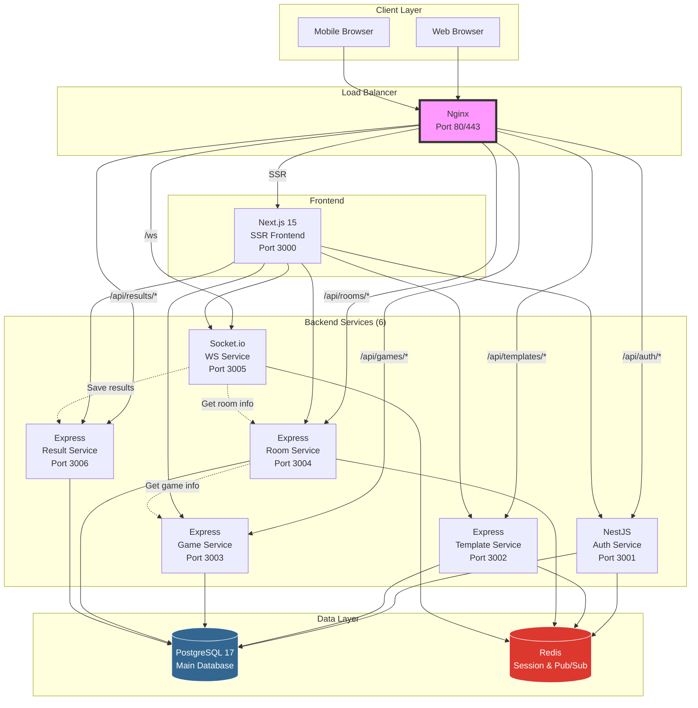
```mermaid
graph TB
    subgraph "Client Layer"
        Browser[Web Browser]
        Mobile[Mobile Browser]
    end

    subgraph "Load Balancer"
        Nginx[Nginx<br/>Port 80/443]
    end

    subgraph "Frontend"
        Web[Next.js 15<br/>SSR Frontend<br/>Port 3000]
    end

    subgraph "Backend Services (6)"
        Auth[NestJS<br/>Auth Service<br/>Port 3001]
        Template[Express<br/>Template Service<br/>Port 3002]
        Game[Express<br/>Game Service<br/>Port 3003]
        Room[Express<br/>Room Service<br/>Port 3004]
        WS[Socket.io<br/>WS Service<br/>Port 3005]
        Result[Express<br/>Result Service<br/>Port 3006]
    end

    subgraph "Data Layer"
        Postgres[(PostgreSQL 17<br/>Main Database)]
        Redis[(Redis<br/>Session & Pub/Sub)]
    end

    Browser --> Nginx
    Mobile --> Nginx

    Nginx -->|SSR| Web
    Nginx -->|/api/auth/*| Auth
    Nginx -->|/api/templates/*| Template
    Nginx -->|/api/games/*| Game
    Nginx -->|/api/rooms/*| Room
    Nginx -->|/ws| WS
    Nginx -->|/api/results/*| Result

    Web --> Auth
    Web --> Template
    Web --> Game
    Web --> Room
    Web --> WS
    Web --> Result

    Auth --> Postgres
    Auth --> Redis
    Template --> Postgres
    Template --> Redis
    Game --> Postgres
    Room --> Postgres
    Room --> Redis
    WS --> Redis
    Result --> Postgres

    Room -.->|Get game info| Game
    WS -.->|Get room info| Room
    WS -.->|Save results| Result

    style Nginx fill:#f9f,stroke:#333,stroke-width:4px
    style Postgres fill:#336791,stroke:#fff,color:#fff
    style Redis fill:#DC382D,stroke:#fff,color:#fff
```

### 2.2 Service Responsibilities

| Service | Port | Technology | Responsibilities |
|---------|------|------------|------------------|
| **Nginx** | 80, 443 | Nginx Alpine | Reverse proxy, load balancing, SSL/TLS, static files |
| **Web** | 3000 | Next.js 15 | SSR pages, client-side routing, UI rendering |
| **Auth Service** | 3001 | NestJS | User authentication, JWT management, sessions |
| **Template Service** | 3002 | Express | Public game templates (read-only, heavy caching) |
| **Game Service** | 3003 | Express | My games CRUD, game customization, favorites |
| **Room Service** | 3004 | Express | Room creation, PIN management, participant tracking |
| **WS Service** | 3005 | Socket.io | Real-time gameplay, WebSocket events, game state sync |
| **Result Service** | 3006 | Express | Game results, statistics, leaderboards, PDF export |
| **PostgreSQL** | 5432 | PostgreSQL 17 | Persistent data storage (users, games, results) |
| **Redis** | 6379 | Redis Alpine | Session storage, real-time state, rate limiting, pub/sub |

### 2.3 Communication Patterns

**Synchronous (REST API):**
- Web ↔ Auth Service: User authentication, profile
- Web ↔ Template Service: Browse public game templates
- Web ↔ Game Service: My games CRUD, customization
- Web ↔ Room Service: Create rooms, manage participants
- Web ↔ Result Service: View game results, statistics
- Services ↔ PostgreSQL: Database queries via Prisma

**Asynchronous (WebSocket):**
- Web ↔ WS Service: Real-time game events, participant updates
- WS Service ↔ Redis: Pub/Sub for horizontal scaling

**Inter-Service Communication:**
- Room Service → Game Service: Get game information (REST)
- WS Service → Room Service: Get room details (REST)
- WS Service → Result Service: Save game results (REST)

**Session Sharing:**
- All services share session data via Redis
- JWT tokens validated across services

---

## 3. API Sequence Diagrams

### 3.1 User Registration & Login

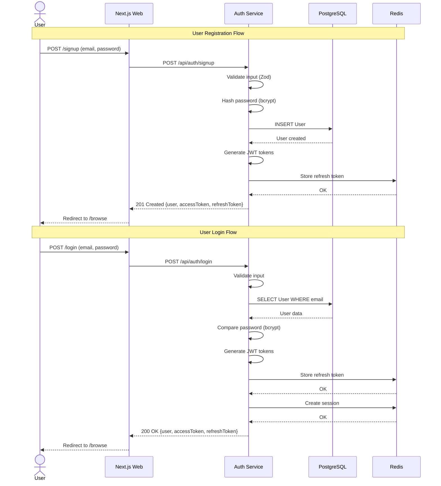
```mermaid
sequenceDiagram
    actor User
    participant Web as Next.js Web
    participant Auth as Auth Service
    participant DB as PostgreSQL
    participant Redis as Redis

    Note over User,Redis: User Registration Flow

    User->>Web: POST /signup (email, password)
    Web->>Auth: POST /api/auth/signup
    Auth->>Auth: Validate input (Zod)
    Auth->>Auth: Hash password (bcrypt)
    Auth->>DB: INSERT User
    DB-->>Auth: User created
    Auth->>Auth: Generate JWT tokens
    Auth->>Redis: Store refresh token
    Redis-->>Auth: OK
    Auth-->>Web: 201 Created {user, accessToken, refreshToken}
    Web-->>User: Redirect to /browse

    Note over User,Redis: User Login Flow

    User->>Web: POST /login (email, password)
    Web->>Auth: POST /api/auth/login
    Auth->>Auth: Validate input
    Auth->>DB: SELECT User WHERE email
    DB-->>Auth: User data
    Auth->>Auth: Compare password (bcrypt)
    Auth->>Auth: Generate JWT tokens
    Auth->>Redis: Store refresh token
    Redis-->>Auth: OK
    Auth->>Redis: Create session
    Redis-->>Auth: OK
    Auth-->>Web: 200 OK {user, accessToken, refreshToken}
    Web-->>User: Redirect to /browse
```

### 3.2 Browse & Favorite Templates

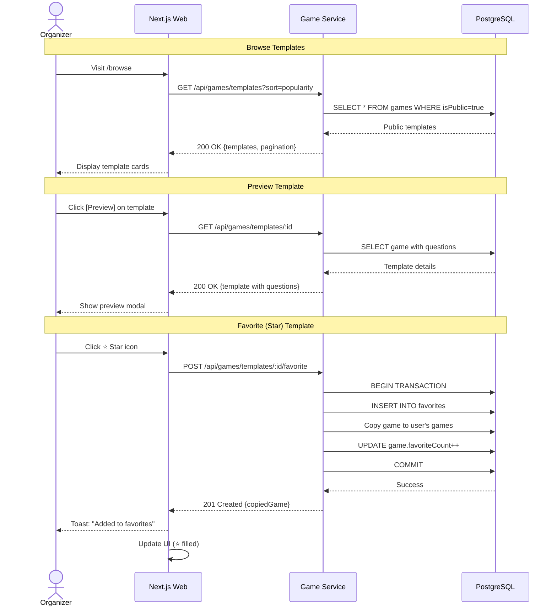
```mermaid
sequenceDiagram
    actor User as Organizer
    participant Web as Next.js Web
    participant Game as Game Service
    participant DB as PostgreSQL

    Note over User,DB: Browse Templates

    User->>Web: Visit /browse
    Web->>Game: GET /api/games/templates?sort=popularity
    Game->>DB: SELECT * FROM games WHERE isPublic=true
    DB-->>Game: Public templates
    Game-->>Web: 200 OK {templates, pagination}
    Web-->>User: Display template cards

    Note over User,DB: Preview Template

    User->>Web: Click [Preview] on template
    Web->>Game: GET /api/games/templates/:id
    Game->>DB: SELECT game with questions
    DB-->>Game: Template details
    Game-->>Web: 200 OK {template with questions}
    Web-->>User: Show preview modal

    Note over User,DB: Favorite (Star) Template

    User->>Web: Click ⭐ Star icon
    Web->>Game: POST /api/games/templates/:id/favorite
    Game->>DB: BEGIN TRANSACTION
    Game->>DB: INSERT INTO favorites
    Game->>DB: Copy game to user's games
    Game->>DB: UPDATE game.favoriteCount++
    Game->>DB: COMMIT
    DB-->>Game: Success
    Game-->>Web: 201 Created {copiedGame}
    Web-->>User: Toast: "Added to favorites"
    Web->>Web: Update UI (⭐ filled)
```

### 3.3 Create & Edit Game

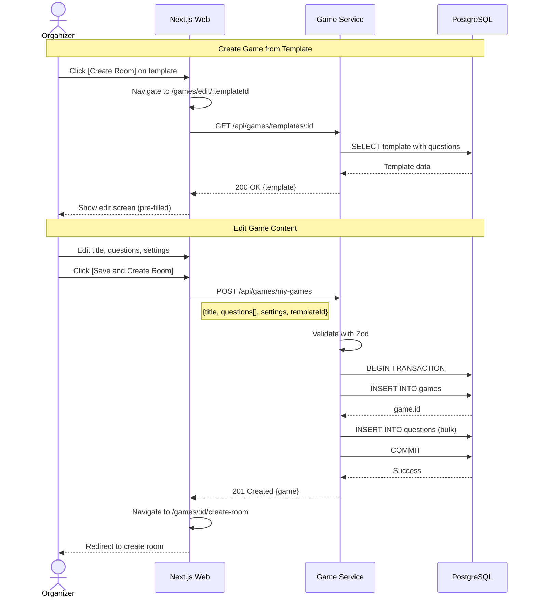
```mermaid
sequenceDiagram
    actor User as Organizer
    participant Web as Next.js Web
    participant Game as Game Service
    participant DB as PostgreSQL

    Note over User,DB: Create Game from Template

    User->>Web: Click [Create Room] on template
    Web->>Web: Navigate to /games/edit/:templateId
    Web->>Game: GET /api/games/templates/:id
    Game->>DB: SELECT template with questions
    DB-->>Game: Template data
    Game-->>Web: 200 OK {template}
    Web-->>User: Show edit screen (pre-filled)

    Note over User,DB: Edit Game Content

    User->>Web: Edit title, questions, settings
    User->>Web: Click [Save and Create Room]
    Web->>Game: POST /api/games/my-games
    Note right of Web: {title, questions[], settings, templateId}
    Game->>Game: Validate with Zod
    Game->>DB: BEGIN TRANSACTION
    Game->>DB: INSERT INTO games
    DB-->>Game: game.id
    Game->>DB: INSERT INTO questions (bulk)
    Game->>DB: COMMIT
    DB-->>Game: Success
    Game-->>Web: 201 Created {game}
    Web->>Web: Navigate to /games/:id/create-room
    Web-->>User: Redirect to create room
```

### 3.4 Create Room & Participant Join

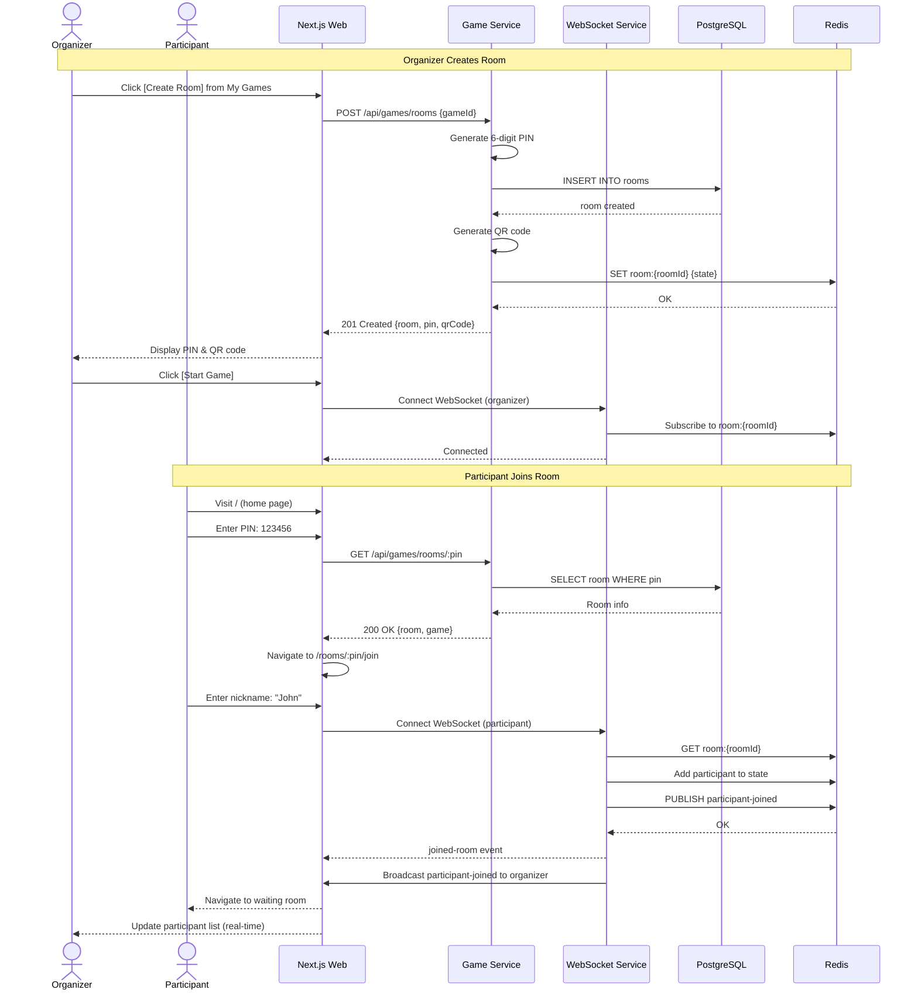
```mermaid
sequenceDiagram
    actor Org as Organizer
    actor Part as Participant
    participant Web as Next.js Web
    participant Game as Game Service
    participant WS as WebSocket Service
    participant DB as PostgreSQL
    participant Redis as Redis

    Note over Org,Redis: Organizer Creates Room

    Org->>Web: Click [Create Room] from My Games
    Web->>Game: POST /api/games/rooms {gameId}
    Game->>Game: Generate 6-digit PIN
    Game->>DB: INSERT INTO rooms
    DB-->>Game: room created
    Game->>Game: Generate QR code
    Game->>Redis: SET room:{roomId} {state}
    Redis-->>Game: OK
    Game-->>Web: 201 Created {room, pin, qrCode}
    Web-->>Org: Display PIN & QR code

    Org->>Web: Click [Start Game]
    Web->>WS: Connect WebSocket (organizer)
    WS->>Redis: Subscribe to room:{roomId}
    WS-->>Web: Connected

    Note over Part,Redis: Participant Joins Room

    Part->>Web: Visit / (home page)
    Part->>Web: Enter PIN: 123456
    Web->>Game: GET /api/games/rooms/:pin
    Game->>DB: SELECT room WHERE pin
    DB-->>Game: Room info
    Game-->>Web: 200 OK {room, game}
    Web->>Web: Navigate to /rooms/:pin/join

    Part->>Web: Enter nickname: "John"
    Web->>WS: Connect WebSocket (participant)
    WS->>Redis: GET room:{roomId}
    WS->>Redis: Add participant to state
    WS->>Redis: PUBLISH participant-joined
    Redis-->>WS: OK
    WS-->>Web: joined-room event
    WS->>Web: Broadcast participant-joined to organizer
    Web-->>Part: Navigate to waiting room
    Web-->>Org: Update participant list (real-time)
```

### 3.5 Play OX Quiz Game

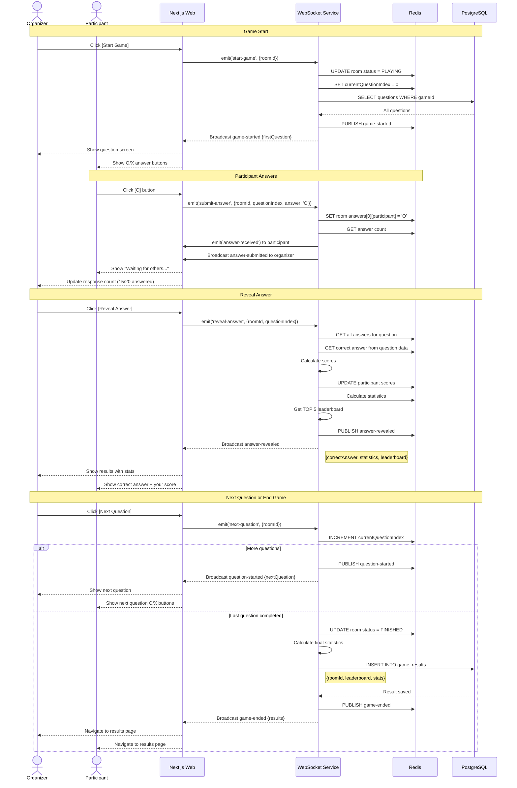
```mermaid
sequenceDiagram
    actor Org as Organizer
    actor Part as Participant
    participant Web as Next.js Web
    participant WS as WebSocket Service
    participant Redis as Redis
    participant DB as PostgreSQL

    Note over Org,DB: Game Start

    Org->>Web: Click [Start Game]
    Web->>WS: emit('start-game', {roomId})
    WS->>Redis: UPDATE room status = PLAYING
    WS->>Redis: SET currentQuestionIndex = 0
    WS->>DB: SELECT questions WHERE gameId
    DB-->>WS: All questions
    WS->>Redis: PUBLISH game-started
    WS-->>Web: Broadcast game-started {firstQuestion}
    Web-->>Org: Show question screen
    Web-->>Part: Show O/X answer buttons

    Note over Part,Redis: Participant Answers

    Part->>Web: Click [O] button
    Web->>WS: emit('submit-answer', {roomId, questionIndex, answer: 'O'})
    WS->>Redis: SET room answers[0][participant] = 'O'
    WS->>Redis: GET answer count
    WS->>Web: emit('answer-received') to participant
    WS->>Web: Broadcast answer-submitted to organizer
    Web-->>Part: Show "Waiting for others..."
    Web-->>Org: Update response count (15/20 answered)

    Note over Org,DB: Reveal Answer

    Org->>Web: Click [Reveal Answer]
    Web->>WS: emit('reveal-answer', {roomId, questionIndex})
    WS->>Redis: GET all answers for question
    WS->>Redis: GET correct answer from question data
    WS->>WS: Calculate scores
    WS->>Redis: UPDATE participant scores
    WS->>Redis: Calculate statistics
    WS->>WS: Get TOP 5 leaderboard
    WS->>Redis: PUBLISH answer-revealed
    WS-->>Web: Broadcast answer-revealed
    Note right of WS: {correctAnswer, statistics, leaderboard}
    Web-->>Org: Show results with stats
    Web-->>Part: Show correct answer + your score

    Note over Org,DB: Next Question or End Game

    Org->>Web: Click [Next Question]
    Web->>WS: emit('next-question', {roomId})
    WS->>Redis: INCREMENT currentQuestionIndex

    alt More questions
        WS->>Redis: PUBLISH question-started
        WS-->>Web: Broadcast question-started {nextQuestion}
        Web-->>Org: Show next question
        Web-->>Part: Show next question O/X buttons
    else Last question completed
        WS->>Redis: UPDATE room status = FINISHED
        WS->>WS: Calculate final statistics
        WS->>DB: INSERT INTO game_results
        Note right of WS: {roomId, leaderboard, stats}
        DB-->>WS: Result saved
        WS->>Redis: PUBLISH game-ended
        WS-->>Web: Broadcast game-ended {results}
        Web-->>Org: Navigate to results page
        Web-->>Part: Navigate to results page
    end
```

### 3.6 View Game Results

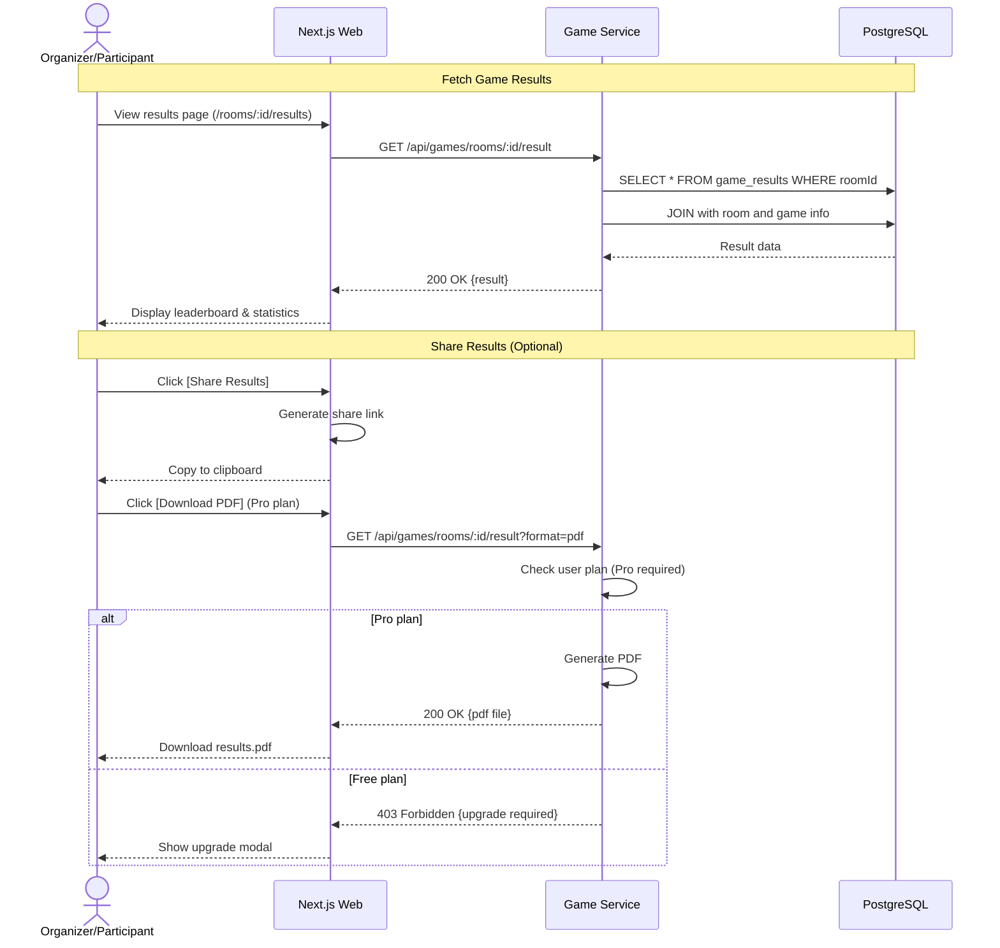
```mermaid
sequenceDiagram
    actor User as Organizer/Participant
    participant Web as Next.js Web
    participant Game as Game Service
    participant DB as PostgreSQL

    Note over User,DB: Fetch Game Results

    User->>Web: View results page (/rooms/:id/results)
    Web->>Game: GET /api/games/rooms/:id/result
    Game->>DB: SELECT * FROM game_results WHERE roomId
    Game->>DB: JOIN with room and game info
    DB-->>Game: Result data
    Game-->>Web: 200 OK {result}
    Web-->>User: Display leaderboard & statistics

    Note over User,DB: Share Results (Optional)

    User->>Web: Click [Share Results]
    Web->>Web: Generate share link
    Web-->>User: Copy to clipboard

    User->>Web: Click [Download PDF] (Pro plan)
    Web->>Game: GET /api/games/rooms/:id/result?format=pdf
    Game->>Game: Check user plan (Pro required)
    alt Pro plan
        Game->>Game: Generate PDF
        Game-->>Web: 200 OK {pdf file}
        Web-->>User: Download results.pdf
    else Free plan
        Game-->>Web: 403 Forbidden {upgrade required}
        Web-->>User: Show upgrade modal
    end
```

### 3.7 Token Refresh Flow

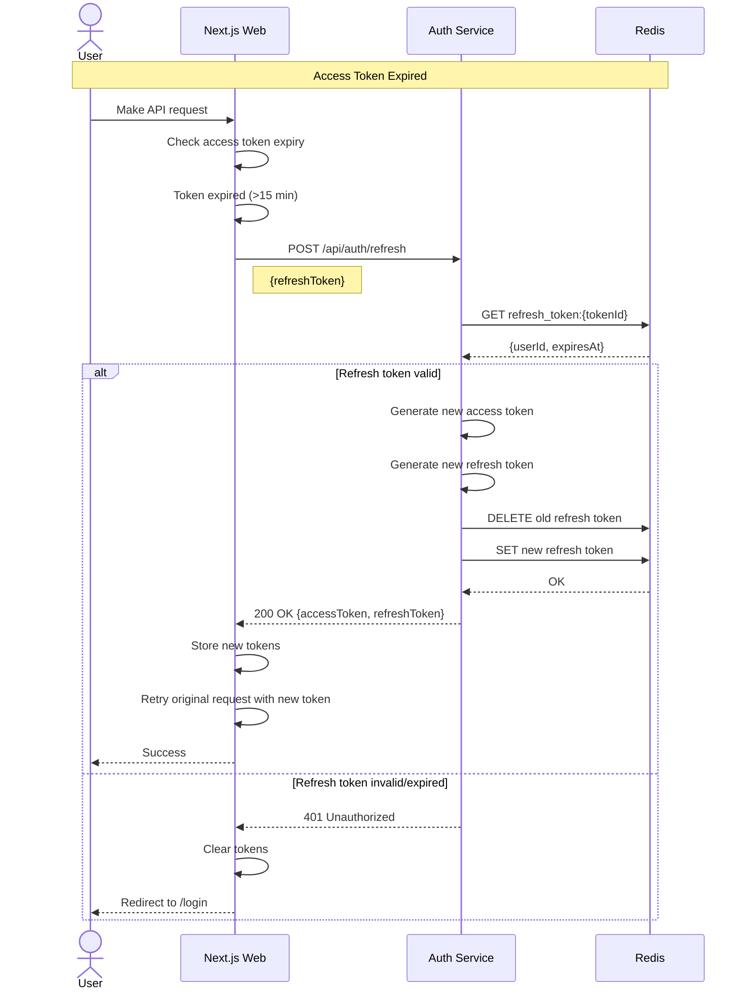
```mermaid
sequenceDiagram
    actor User
    participant Web as Next.js Web
    participant Auth as Auth Service
    participant Redis as Redis

    Note over User,Redis: Access Token Expired

    User->>Web: Make API request
    Web->>Web: Check access token expiry
    Web->>Web: Token expired (>15 min)

    Web->>Auth: POST /api/auth/refresh
    Note right of Web: {refreshToken}
    Auth->>Redis: GET refresh_token:{tokenId}
    Redis-->>Auth: {userId, expiresAt}

    alt Refresh token valid
        Auth->>Auth: Generate new access token
        Auth->>Auth: Generate new refresh token
        Auth->>Redis: DELETE old refresh token
        Auth->>Redis: SET new refresh token
        Redis-->>Auth: OK
        Auth-->>Web: 200 OK {accessToken, refreshToken}
        Web->>Web: Store new tokens
        Web->>Web: Retry original request with new token
        Web-->>User: Success
    else Refresh token invalid/expired
        Auth-->>Web: 401 Unauthorized
        Web->>Web: Clear tokens
        Web-->>User: Redirect to /login
    end
```

---

## 4. Component Architecture

### 4.1 Frontend (Next.js 15) Structure

```mermaid
graph TB
    subgraph "App Router (Next.js 15)"
        Root[app/layout.tsx<br/>Root Layout]

        subgraph "Public Routes"
            Home[app/page.tsx<br/>Home - PIN Entry]
            Login[app/login/page.tsx<br/>Login]
            Signup[app/signup/page.tsx<br/>Signup]
        end

        subgraph "Authenticated Routes"
            Browse[app/browse/page.tsx<br/>Browse Templates]
            MyGames[app/my-games/page.tsx<br/>My Games]
            EditGame[app/games/edit/[id]/page.tsx<br/>Edit Game]
            CreateRoom[app/games/[id]/create-room/page.tsx<br/>Create Room]
        end

        subgraph "Game Flow"
            Join[app/rooms/[pin]/join/page.tsx<br/>Nickname Setup]
            Waiting[app/rooms/[id]/waiting/page.tsx<br/>Waiting Room]
            Play[app/rooms/[id]/play/page.tsx<br/>Game Play]
            Results[app/rooms/[id]/results/page.tsx<br/>Results]
        end

        Root --> Home
        Root --> Login
        Root --> Signup
        Root --> Browse
        Root --> MyGames
        Root --> EditGame
        Root --> CreateRoom
        Root --> Join
        Root --> Waiting
        Root --> Play
        Root --> Results
    end

    subgraph "Shared Components"
        GameCard[GameCard.tsx]
        QuestionEditor[QuestionEditor.tsx]
        Leaderboard[Leaderboard.tsx]
        PINDisplay[PINDisplay.tsx]
    end

    subgraph "State Management"
        AuthStore[useAuthStore<br/>Zustand]
        GameStore[useGameStore<br/>Zustand]
        SocketStore[useSocketStore<br/>Zustand]
    end

    Browse --> GameCard
    MyGames --> GameCard
    EditGame --> QuestionEditor
    CreateRoom --> PINDisplay
    Play --> Leaderboard
    Results --> Leaderboard

    Home --> AuthStore
    Browse --> AuthStore
    Browse --> GameStore
    Play --> SocketStore
```

### 4.2 State Management (Zustand)

**Auth Store:**
```typescript
interface AuthStore {
  user: User | null
  accessToken: string | null
  refreshToken: string | null

  login: (email: string, password: string) => Promise<void>
  signup: (email: string, password: string) => Promise<void>
  logout: () => Promise<void>
  refreshAccessToken: () => Promise<void>
}
```

**Game Store:**
```typescript
interface GameStore {
  templates: Game[]
  myGames: Game[]
  currentGame: Game | null

  fetchTemplates: (filters: Filters) => Promise<void>
  fetchMyGames: () => Promise<void>
  favoriteGame: (gameId: string) => Promise<void>
  createGame: (game: CreateGameDto) => Promise<void>
  updateGame: (gameId: string, game: UpdateGameDto) => Promise<void>
  deleteGame: (gameId: string) => Promise<void>
}
```

**Socket Store:**
```typescript
interface SocketStore {
  socket: Socket | null
  roomState: RoomState | null
  participants: Participant[]
  currentQuestion: Question | null
  leaderboard: LeaderboardEntry[]

  connect: () => void
  disconnect: () => void
  joinRoom: (pin: string, nickname: string) => void
  startGame: (roomId: string) => void
  submitAnswer: (answer: string) => void
  revealAnswer: () => void
  nextQuestion: () => void
}
```

---

## 5. Data Flow Diagrams

### 5.1 Real-time Game State Flow

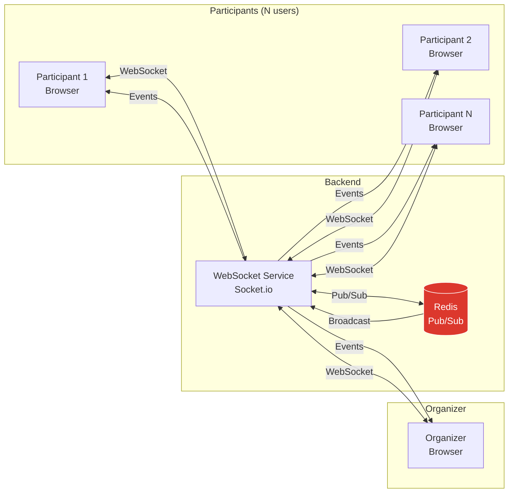
```mermaid
graph LR
    subgraph "Participants (N users)"
        P1[Participant 1<br/>Browser]
        P2[Participant 2<br/>Browser]
        PN[Participant N<br/>Browser]
    end

    subgraph "Organizer"
        Org[Organizer<br/>Browser]
    end

    subgraph "Backend"
        WS[WebSocket Service<br/>Socket.io]
        Redis[(Redis<br/>Pub/Sub)]
    end

    P1 <-->|WebSocket| WS
    P2 <-->|WebSocket| WS
    PN <-->|WebSocket| WS
    Org <-->|WebSocket| WS

    WS <-->|Pub/Sub| Redis

    Redis -->|Broadcast| WS
    WS -->|Events| P1
    WS -->|Events| P2
    WS -->|Events| PN
    WS -->|Events| Org

    style Redis fill:#DC382D,stroke:#fff,color:#fff
```

### 5.2 Session & Authentication Flow

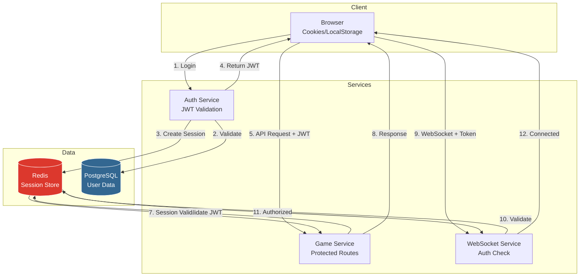
```mermaid
graph TB
    subgraph "Client"
        Browser[Browser<br/>Cookies/LocalStorage]
    end

    subgraph "Services"
        Auth[Auth Service<br/>JWT Validation]
        Game[Game Service<br/>Protected Routes]
        WS[WebSocket Service<br/>Auth Check]
    end

    subgraph "Data"
        Redis[(Redis<br/>Session Store)]
        DB[(PostgreSQL<br/>User Data)]
    end

    Browser -->|1. Login| Auth
    Auth -->|2. Validate| DB
    Auth -->|3. Create Session| Redis
    Auth -->|4. Return JWT| Browser

    Browser -->|5. API Request + JWT| Game
    Game -->|6. Validate JWT| Redis
    Redis -->|7. Session Valid| Game
    Game -->|8. Response| Browser

    Browser -->|9. WebSocket + Token| WS
    WS -->|10. Validate| Redis
    Redis -->|11. Authorized| WS
    WS -->|12. Connected| Browser

    style Redis fill:#DC382D,stroke:#fff,color:#fff
    style DB fill:#336791,stroke:#fff,color:#fff
```

### 5.3 Database Read/Write Patterns

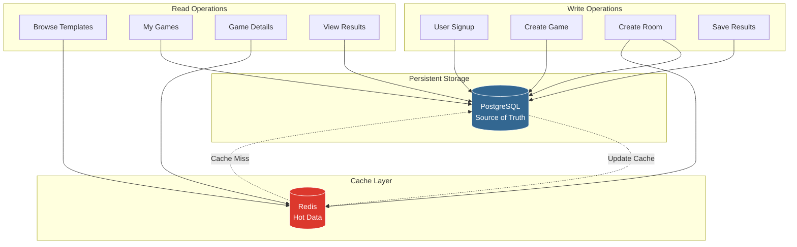
```mermaid
graph TB
    subgraph "Write Operations"
        W1[User Signup]
        W2[Create Game]
        W3[Create Room]
        W4[Save Results]
    end

    subgraph "Read Operations"
        R1[Browse Templates]
        R2[My Games]
        R3[Game Details]
        R4[View Results]
    end

    subgraph "Cache Layer"
        Redis[(Redis<br/>Hot Data)]
    end

    subgraph "Persistent Storage"
        Postgres[(PostgreSQL<br/>Source of Truth)]
    end

    W1 --> Postgres
    W2 --> Postgres
    W3 --> Postgres
    W3 --> Redis
    W4 --> Postgres

    R1 --> Redis
    Redis -.->|Cache Miss| Postgres
    Postgres -.->|Update Cache| Redis

    R2 --> Postgres
    R3 --> Redis
    R4 --> Postgres

    style Redis fill:#DC382D,stroke:#fff,color:#fff
    style Postgres fill:#336791,stroke:#fff,color:#fff
```

### 5.4 Error Handling & Recovery

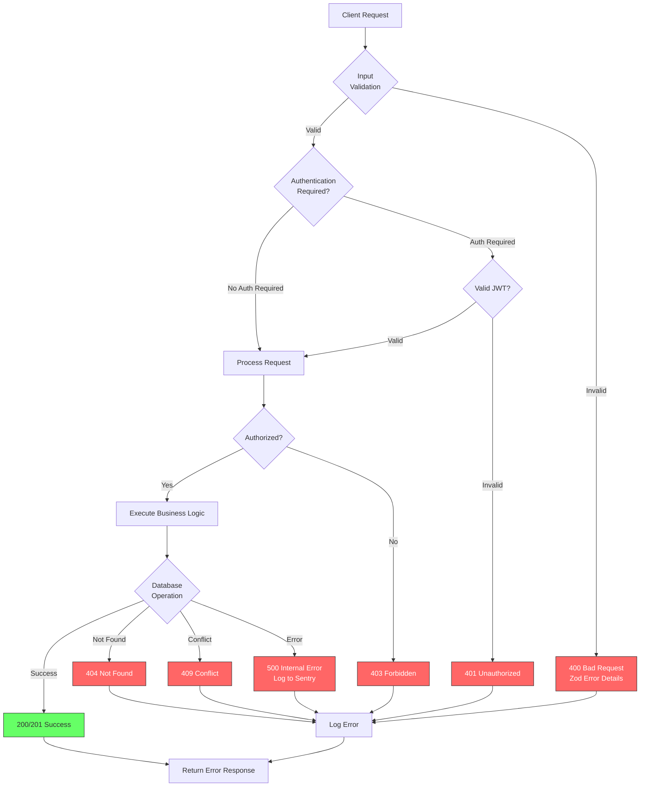
```mermaid
graph TB
    Request[Client Request]

    Request --> Validate{Input<br/>Validation}

    Validate -->|Valid| Auth{Authentication<br/>Required?}
    Validate -->|Invalid| E1[400 Bad Request<br/>Zod Error Details]

    Auth -->|No Auth Required| Process
    Auth -->|Auth Required| CheckToken{Valid JWT?}

    CheckToken -->|Valid| Process[Process Request]
    CheckToken -->|Invalid| E2[401 Unauthorized]

    Process --> Authorize{Authorized?}

    Authorize -->|Yes| Execute[Execute Business Logic]
    Authorize -->|No| E3[403 Forbidden]

    Execute --> DB{Database<br/>Operation}

    DB -->|Success| Success[200/201 Success]
    DB -->|Not Found| E4[404 Not Found]
    DB -->|Conflict| E5[409 Conflict]
    DB -->|Error| E6[500 Internal Error<br/>Log to Sentry]

    E1 --> Log[Log Error]
    E2 --> Log
    E3 --> Log
    E4 --> Log
    E5 --> Log
    E6 --> Log

    Log --> Response[Return Error Response]

    Success --> Response

    style E1 fill:#f66,stroke:#333,color:#fff
    style E2 fill:#f66,stroke:#333,color:#fff
    style E3 fill:#f66,stroke:#333,color:#fff
    style E4 fill:#f66,stroke:#333,color:#fff
    style E5 fill:#f66,stroke:#333,color:#fff
    style E6 fill:#f66,stroke:#333,color:#fff
    style Success fill:#6f6,stroke:#333
```

---

## 6. Deployment Architecture (Production)

### 6.1 Docker Compose Deployment

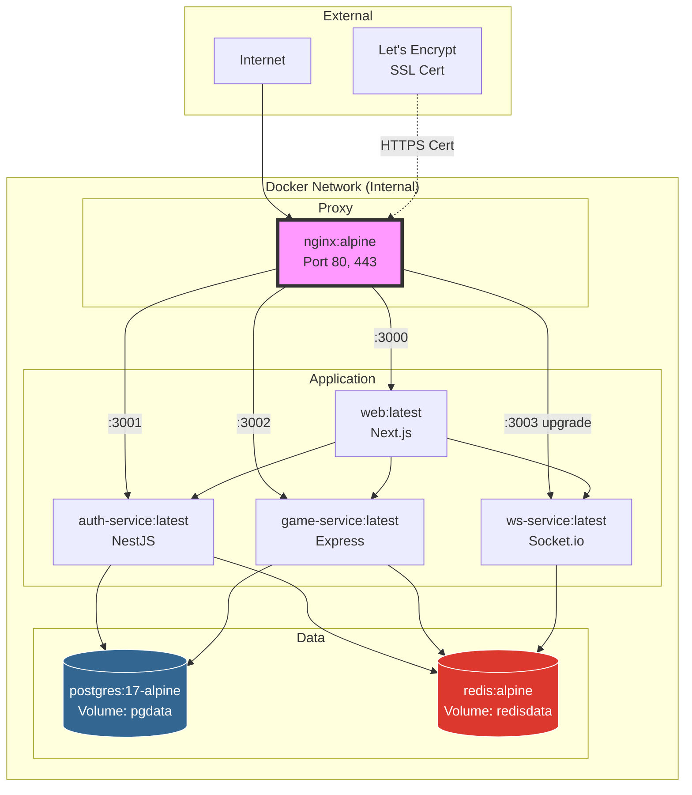
```mermaid
graph TB
    subgraph "External"
        Internet[Internet]
        LetsEncrypt[Let's Encrypt<br/>SSL Cert]
    end

    subgraph "Docker Network (Internal)"
        subgraph "Proxy"
            Nginx[nginx:alpine<br/>Port 80, 443]
        end

        subgraph "Application"
            Web[web:latest<br/>Next.js]
            Auth[auth-service:latest<br/>NestJS]
            Game[game-service:latest<br/>Express]
            WS[ws-service:latest<br/>Socket.io]
        end

        subgraph "Data"
            Postgres[(postgres:17-alpine<br/>Volume: pgdata)]
            Redis[(redis:alpine<br/>Volume: redisdata)]
        end
    end

    Internet --> Nginx
    LetsEncrypt -.->|HTTPS Cert| Nginx

    Nginx -->|:3000| Web
    Nginx -->|:3001| Auth
    Nginx -->|:3002| Game
    Nginx -->|:3003 upgrade| WS

    Web --> Auth
    Web --> Game
    Web --> WS

    Auth --> Postgres
    Auth --> Redis
    Game --> Postgres
    Game --> Redis
    WS --> Redis

    style Nginx fill:#f9f,stroke:#333,stroke-width:4px
    style Postgres fill:#336791,stroke:#fff,color:#fff
    style Redis fill:#DC382D,stroke:#fff,color:#fff
```

### 6.2 Container Health Checks

```yaml
# docker-compose.yml health checks
services:
  postgres:
    healthcheck:
      test: ["CMD-SHELL", "pg_isready -U postgres"]
      interval: 10s
      timeout: 5s
      retries: 5

  redis:
    healthcheck:
      test: ["CMD", "redis-cli", "ping"]
      interval: 10s
      timeout: 3s
      retries: 5

  auth-service:
    healthcheck:
      test: ["CMD", "curl", "-f", "http://localhost:3001/health"]
      interval: 30s
      timeout: 10s
      retries: 3
    depends_on:
      postgres:
        condition: service_healthy
      redis:
        condition: service_healthy
```

---

## 7. Scaling Strategy

### 7.1 Horizontal Scaling

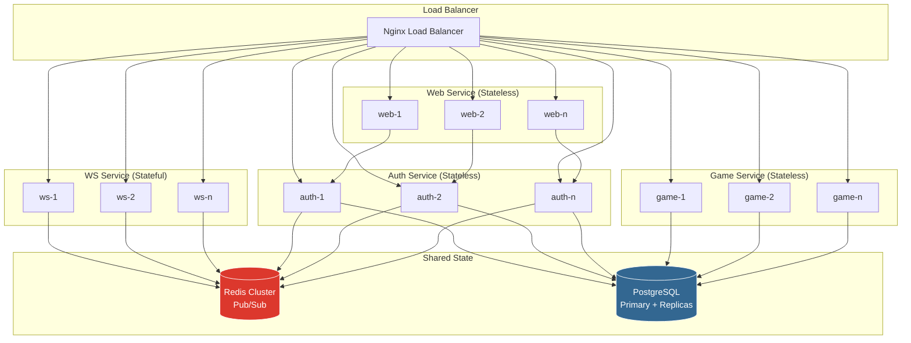
```mermaid
graph TB
    subgraph "Load Balancer"
        LB[Nginx Load Balancer]
    end

    subgraph "Web Service (Stateless)"
        Web1[web-1]
        Web2[web-2]
        WebN[web-n]
    end

    subgraph "Auth Service (Stateless)"
        Auth1[auth-1]
        Auth2[auth-2]
        AuthN[auth-n]
    end

    subgraph "Game Service (Stateless)"
        Game1[game-1]
        Game2[game-2]
        GameN[game-n]
    end

    subgraph "WS Service (Stateful)"
        WS1[ws-1]
        WS2[ws-2]
        WSN[ws-n]
    end

    subgraph "Shared State"
        Redis[(Redis Cluster<br/>Pub/Sub)]
        Postgres[(PostgreSQL<br/>Primary + Replicas)]
    end

    LB --> Web1
    LB --> Web2
    LB --> WebN

    LB --> Auth1
    LB --> Auth2
    LB --> AuthN

    LB --> Game1
    LB --> Game2
    LB --> GameN

    LB --> WS1
    LB --> WS2
    LB --> WSN

    Web1 --> Auth1
    Web2 --> Auth2
    WebN --> AuthN

    Auth1 --> Postgres
    Auth2 --> Postgres
    AuthN --> Postgres

    Game1 --> Postgres
    Game2 --> Postgres
    GameN --> Postgres

    WS1 --> Redis
    WS2 --> Redis
    WSN --> Redis

    Auth1 --> Redis
    Auth2 --> Redis
    AuthN --> Redis

    style Redis fill:#DC382D,stroke:#fff,color:#fff
    style Postgres fill:#336791,stroke:#fff,color:#fff
```

**Key Points:**
- **Stateless Services**: Web, Auth, Game can scale horizontally (add more instances)
- **Stateful Service**: WebSocket uses Redis Pub/Sub for cross-instance communication
- **Session Sharing**: All instances share sessions via Redis
- **Database**: PostgreSQL with read replicas for scaling reads

### 7.2 Caching Strategy

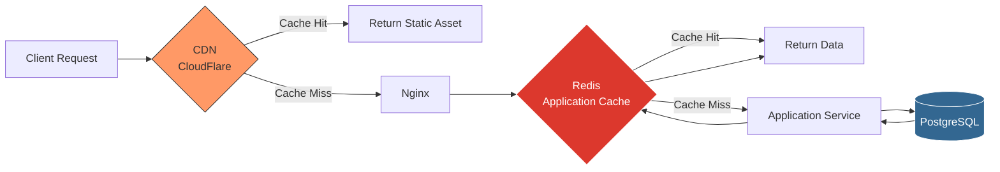
```mermaid
graph LR
    Client[Client Request]

    Client --> CDN{CDN<br/>CloudFlare}
    CDN -->|Cache Hit| Return1[Return Static Asset]
    CDN -->|Cache Miss| Nginx

    Nginx --> AppCache{Redis<br/>Application Cache}
    AppCache -->|Cache Hit| Return2[Return Data]
    AppCache -->|Cache Miss| App[Application Service]

    App --> DB[(PostgreSQL)]
    DB --> App
    App --> AppCache
    AppCache --> Return2

    style CDN fill:#f96,stroke:#333
    style AppCache fill:#DC382D,stroke:#fff,color:#fff
    style DB fill:#336791,stroke:#fff,color:#fff
```

**Caching Layers:**
1. **CDN (CloudFlare)**: Static assets, images, CSS, JS
2. **Redis**: API responses, session data, game templates
3. **PostgreSQL**: Source of truth

**Cache Invalidation:**
- Template updates → Clear Redis cache
- User logout → Remove session from Redis
- Game result → Update cache with new data

---

## Appendix: Technology Versions

| Technology | Version | Purpose |
|------------|---------|---------|
| **Node.js** | 24+ | Runtime environment |
| **PostgreSQL** | 17-alpine | Database |
| **Redis** | latest (alpine) | Cache & pub/sub |
| **Next.js** | 15 | Frontend framework |
| **React** | 19 | UI library |
| **NestJS** | 10+ | Auth service framework |
| **Express** | 4+ | Game service framework |
| **Socket.io** | 4+ | WebSocket library |
| **Prisma** | 6+ | ORM |
| **TypeScript** | 5+ | Programming language |
| **Docker** | latest | Containerization |
| **Nginx** | alpine | Reverse proxy |

---

**Next Steps**: [Begin Implementation](../README.md#implementation)

---

**Document Version History:**

| Version | Date | Changes |
|---------|------|---------|
| 1.0 | 2025-11-11 | Initial architecture diagrams created |
