# 🏗️ System Architecture & Diagrams

## 📌 Document Info

**Document**: System Architecture & Diagrams
**Version**: 2.0
**Last Updated**: 2025-11-18
**Purpose**: Visual representation of database schema, API flows, and system architecture

**Status**: ✅ Synchronized with actual implementation (as of 2025-11-18)

---

## 📑 Table of Contents

1. [Database ER Diagram](#1-database-er-diagram)
2. [System Architecture](#2-system-architecture)
3. [API Sequence Diagrams](#3-api-sequence-diagrams)
4. [Component Architecture](#4-component-architecture)
5. [Data Flow Diagrams](#5-data-flow-diagrams)

---

## 1. Database ER Diagram

### 1.1 Entity Relationship Diagram

```mermaid
erDiagram
    User ||--o{ Game : creates
    User ||--o{ Room : organizes
    User ||--o{ Favorite : has

    Game ||--o{ Question : contains
    Game ||--o{ Room : uses
    Game ||--o{ Favorite : starred_by
    Game ||--o{ GameResult : produces

    Room ||--|| GameResult : generates

    User {
        string id PK "cuid"
        string email UK "unique, indexed"
        string passwordHash
        string name
        enum role "ORGANIZER, ADMIN"
        datetime createdAt
        datetime updatedAt
    }

    Game {
        string id PK "cuid"
        string title
        string description
        string thumbnail
        enum gameType "OX_QUIZ, BALANCE_GAME, etc"
        enum category "ICE_BREAKING, QUIZ, etc"
        boolean isPublic
        int duration "minutes"
        int minPlayers
        int maxPlayers
        boolean needsMobile
        int playCount
        int favoriteCount
        json settings
        string userId FK "nullable for public templates"
        datetime createdAt
        datetime updatedAt
    }

    Question {
        string id PK "cuid"
        string gameId FK
        int order "question sequence"
        string content "question text"
        json data "game-type specific data"
        string imageUrl "optional"
        string videoUrl "optional"
        string audioUrl "optional"
        datetime createdAt
        datetime updatedAt
    }

    Favorite {
        string id PK "cuid"
        string userId FK
        string gameId FK
        datetime createdAt
    }

    Room {
        string id PK "cuid"
        string pin UK "6-digit, unique, indexed"
        string gameId FK
        string organizerId FK
        enum status "WAITING, PLAYING, FINISHED"
        datetime createdAt
        datetime startedAt "nullable"
        datetime endedAt "nullable"
        datetime expiresAt "for cleanup, indexed"
    }

    GameResult {
        string id PK "cuid"
        string roomId FK UK "one-to-one with Room"
        int participantCount
        int duration "seconds"
        float averageScore
        json leaderboard "top 10 players"
        json questionStats "per-question statistics"
        datetime createdAt
    }
```

### 1.2 Table Indexes

**Performance Optimization:**

```sql
-- User
CREATE INDEX idx_user_email ON users(email);

-- Game
CREATE INDEX idx_game_type_public ON games(gameType, isPublic);
CREATE INDEX idx_game_category_public ON games(category, isPublic);
CREATE INDEX idx_game_userId ON games(userId);

-- Question
CREATE INDEX idx_question_gameId_order ON questions(gameId, order);

-- Favorite
CREATE UNIQUE INDEX idx_favorite_userId_gameId ON favorites(userId, gameId);
CREATE INDEX idx_favorite_userId ON favorites(userId);

-- Room
CREATE INDEX idx_room_pin ON rooms(pin);
CREATE INDEX idx_room_organizerId ON rooms(organizerId);
CREATE INDEX idx_room_expiresAt ON rooms(expiresAt);

-- GameResult
CREATE INDEX idx_gameresult_roomId ON game_results(roomId);
```

### 1.3 Data Relationships

**One-to-Many:**
- User → Games (1:N) - A user can create multiple games
- User → Rooms (1:N) - A user can organize multiple rooms
- User → Favorites (1:N) - A user can favorite multiple games
- Game → Questions (1:N) - A game contains multiple questions
- Game → Rooms (1:N) - A game can be played in multiple rooms
- Game → Favorites (1:N) - A game can be favorited by multiple users

**One-to-One:**
- Room → GameResult (1:1) - Each room generates one result

**Cascade Deletes:**
- Delete User → Cascade delete Games, Rooms, Favorites
- Delete Game → Cascade delete Questions, Favorites (but not Rooms)
- Delete Room → Cascade delete GameResult

---

## 2. System Architecture

### 2.1 Microservice Architecture (MSA) - 6 Backend Services


### 2.2 Service Responsibilities

| Service | Port | Technology | Responsibilities |
|---------|------|------------|------------------|
| **Nginx** | 80, 443 | Nginx Alpine | Reverse proxy, load balancing, SSL/TLS, static files |
| **Web** | 3000 | Next.js 15 | SSR pages, client-side routing, UI rendering |
| **Auth Service** | 3001 | NestJS | User authentication, JWT management, sessions |
| **Template Service** | 3002 | Express | Public game templates (read-only, heavy caching) |
| **Game Service** | 3003 | Express | My games CRUD, game customization, favorites |
| **Room Service** | 3004 | Express | Room creation, PIN management, participant tracking |
| **WS Service** | 3005 | Socket.io | Real-time gameplay, WebSocket events, game state sync |
| **Result Service** | 3006 | Express | Game results, statistics, leaderboards, PDF export |
| **PostgreSQL** | 5432 | PostgreSQL 17 | Persistent data storage (users, games, results) |
| **Redis** | 6379 | Redis Alpine | Session storage, real-time state, rate limiting, pub/sub |

### 2.3 Communication Patterns

**Synchronous (REST API):**
- Web ↔ Auth Service: User authentication, profile
- Web ↔ Template Service: Browse public game templates
- Web ↔ Game Service: My games CRUD, customization
- Web ↔ Room Service: Create rooms, manage participants
- Web ↔ Result Service: View game results, statistics
- Services ↔ PostgreSQL: Database queries via Prisma

**Asynchronous (WebSocket):**
- Web ↔ WS Service: Real-time game events, participant updates
- WS Service ↔ Redis: Pub/Sub for horizontal scaling

**Inter-Service Communication:**
- Room Service → Game Service: Get game information (REST)
- WS Service → Room Service: Get room details (REST)
- WS Service → Result Service: Save game results (REST)

**Session Sharing:**
- All services share session data via Redis
- JWT tokens validated across services

---

## 3. API Sequence Diagrams

### 3.1 User Registration & Login


### 3.2 Browse & Favorite Templates


### 3.3 Create & Edit Game (Actual Implementation)

```mermaid
sequenceDiagram
    actor User as Organizer
    participant Web as Next.js Web
    participant Template as Template Service
    participant Game as Game Service
    participant Room as Room Service
    participant DB as PostgreSQL
    participant Redis as Redis

    Note over User,Redis: Browse & Select Template

    User->>Web: Visit /browse
    Web->>Template: GET /api/templates?filters
    Template->>DB: SELECT templates WHERE isPublic=true
    DB-->>Template: Public templates
    Template-->>Web: 200 OK {templates}
    Web-->>User: Display template cards

    User->>Web: Click [방 만들기] on template
    Web->>Web: Navigate to /edit/:templateId
    Web->>Template: GET /api/templates/:id
    Template->>DB: SELECT template with questions
    DB-->>Template: Template data
    Template-->>Web: 200 OK {template}
    Web-->>User: Show edit screen (pre-filled)

    Note over User,Redis: Edit & Create Room in One Step

    User->>Web: Edit title, questions, settings
    User->>Web: Click [저장 & 방 만들기]

    alt New Game (no gameId)
        Web->>Game: POST /api/games
        Note right of Web: {title, questions[], settings}
        Game->>DB: BEGIN TRANSACTION
        Game->>DB: INSERT INTO games
        DB-->>Game: game.id
        Game->>DB: INSERT INTO questions (bulk)
        Game->>DB: COMMIT
        Game-->>Web: 201 Created {game}
    else Existing Game (has gameId)
        Web->>Game: PUT /api/games/:id
        Game->>DB: UPDATE game, questions
        Game-->>Web: 200 OK {game}
    end

    Web->>Room: POST /api/rooms
    Note right of Web: {gameId, expiresInMinutes: 60}
    Room->>Room: Generate 6-digit PIN
    Room->>DB: INSERT INTO rooms
    Room->>Redis: SET room:state (initial)
    Room-->>Web: 201 Created {room, pin}

    Web->>Web: Navigate to /room/:pin/waiting
    Web-->>User: Waiting room (PIN displayed)
```



### 3.4 Organizer Waiting Room & Participant Join (Actual Implementation)

```mermaid
sequenceDiagram
    actor Org as Organizer
    actor Part as Participant
    participant Web as Next.js Web
    participant Auth as Auth Service
    participant Room as Room Service
    participant WS as WebSocket Service
    participant DB as PostgreSQL
    participant Redis as Redis

    Note over Org,Redis: Organizer on Waiting Room

    Org->>Web: Navigate to /room/:pin/waiting
    Web->>Auth: Verify JWT token
    Auth-->>Web: User authenticated
    Web->>Room: GET /api/rooms/:pin
    Room->>DB: SELECT room WHERE pin
    DB-->>Room: Room data
    Room-->>Web: 200 OK {room}

    Web->>Web: Check: room.organizerId === currentUser.id
    Note right of Web: If not organizer → redirect to /room/:pin

    Web->>Web: Store nickname in sessionStorage
    Note right of Web: sessionStorage['room_:pin_nickname'] = user.name

    Web->>WS: Connect WebSocket {pin, nickname, JWT}
    WS->>WS: Validate JWT → isOrganizer = true
    WS->>Redis: GET room:state
    WS->>Redis: Add player {id, nickname, isOrganizer: true}
    WS->>Redis: SET room:state
    WS-->>Web: emit('joined-room', {room, game})
    Web-->>Org: Display waiting room (PIN visible)

    Web->>Room: GET /api/rooms/:pin/participants (poll every 3s)
    Room->>DB: SELECT participants (REST API joins)
    Room-->>Web: Participant count
    Web-->>Org: Update participant list

    Note over Part,Redis: Participant Joins

    Part->>Web: Visit / (home)
    Part->>Web: Enter PIN: 123456 → Submit
    Web->>Web: Navigate to /room/:pin
    Web->>Room: GET /api/rooms/:pin
    Room->>DB: SELECT room
    Room-->>Web: 200 OK {room}

    Part->>Web: Enter nickname: "Alice"
    Web->>Room: POST /api/rooms/:pin/join {nickname, deviceId}
    Room->>DB: INSERT INTO participants
    DB-->>Room: participant created
    Room->>Redis: SET participant:session:{sessionId}
    Room-->>Web: 201 Created {sessionId, participant}

    Web->>Web: Store in localStorage + sessionStorage
    Note right of Web: localStorage['room_:pin_sessionId'] = sessionId<br/>sessionStorage['room_:pin_nickname'] = nickname

    Web->>Web: Navigate to /room/:pin/game
    Web->>WS: Connect WebSocket {pin, nickname, sessionId}
    WS->>Redis: Validate sessionId
    WS->>Redis: Add player {id, nickname, isOrganizer: false}
    WS->>Web: Broadcast 'participant-joined'
    Web-->>Part: Show "게임 시작 대기 중..."
    Web-->>Org: Real-time participant list update
```



### 3.5 Play OX Quiz Game (Actual Implementation)

```mermaid
sequenceDiagram
    actor Org as Organizer
    actor Part as Participant
    participant Web as Next.js Web
    participant WS as WebSocket Service
    participant Result as Result Service
    participant Redis as Redis
    participant DB as PostgreSQL

    Note over Org,DB: Game Start

    Org->>Web: Click [게임 시작] on waiting page
    Web->>WS: emit('start-game', {pin})
    WS->>Redis: UPDATE room:state status = 'playing'
    WS->>Redis: SET currentQuestionIndex = 0
    WS->>DB: SELECT game with questions
    DB-->>WS: Game + questions
    WS->>Redis: PUBLISH 'game-started'
    WS-->>Web: Broadcast 'game-started' {room}
    WS->>Redis: PUBLISH 'question-started'
    WS-->>Web: Broadcast 'question-started' {question, index: 0}

    Web->>Web: Organizer redirects to /room/:pin/game
    Web-->>Org: Show question + real-time stats (isOrganizer view)
    Web-->>Part: Show question + O/X buttons (participant view)

    Note over Part,Redis: Participant Answers

    Part->>Web: Click [O] button
    Web->>WS: emit('submit-answer', {pin, questionIndex, answer, responseTimeMs})
    WS->>Redis: GET room:state
    WS->>Redis: UPDATE player.answers[index] = {answer, responseTimeMs}
    WS->>Redis: SET room:state
    WS->>Web: emit('answer-received') to participant
    Note right of WS: {correct, score, responseTimeMs}
    WS->>Web: Broadcast 'answer-submitted' to organizer
    Note right of WS: {playerId, playerNickname, questionIndex}
    Web-->>Part: Show "대기 중..." (disabled buttons)
    Web-->>Org: Update stats (15/20 answered, 85% O, 15% X)

    Note over Org,DB: End Question

    alt Timer expires (auto)
        Web->>Web: Timer component triggers
        Web->>WS: emit('end-question', {pin, questionIndex})
    else Organizer manually ends
        Org->>Web: Click [질문 종료]
        Web->>WS: emit('end-question', {pin, questionIndex})
    end

    WS->>Redis: GET all player answers for question
    WS->>WS: Calculate scores (correct + time bonus)
    WS->>Redis: UPDATE player scores
    WS->>WS: Calculate TOP 5 leaderboard
    WS->>Redis: PUBLISH 'question-ended'
    WS-->>Web: Broadcast 'question-ended'
    Note right of WS: {correctAnswer, results[], leaderboard, statistics}
    Web-->>Org: Show answer + stats + leaderboard
    Web-->>Part: Show correct answer + your score + rank

    Note over Org,DB: Next Question or End Game

    Org->>Web: Click [다음 문제] (organizer only)
    Web->>WS: emit('next-question', {pin})
    WS->>Redis: INCREMENT currentQuestionIndex

    alt More questions
        WS->>Redis: PUBLISH 'question-started'
        WS-->>Web: Broadcast 'question-started' {question, index}
        Web-->>Org: Show next question
        Web-->>Part: Show next question
    else Last question completed
        WS->>Redis: UPDATE room:state status = 'finished'
        WS->>WS: Calculate final leaderboard
        WS->>Result: POST /api/results
        Note right of WS: {roomId, leaderboard, statistics}
        Result->>DB: INSERT INTO game_results
        WS->>Redis: PUBLISH 'game-ended'
        WS-->>Web: Broadcast 'game-ended' {leaderboard, room}
        Web->>Web: roomState.status = 'finished'
        Web-->>Org: Show results section in game page
        Web-->>Part: Show results section in game page
    end
```



### 3.6 View Game Results (Actual Implementation)

**Note:** Results are displayed directly in the game page (`/room/:pin/game`) when `roomState.status === 'finished'`. No separate results page exists.


**Current Implementation:**

- Results are shown in `/room/:pin/game` page (status-based rendering)
- Leaderboard data comes from WebSocket `game-ended` event
- No navigation to separate results page
- Result Service API exists but not yet used in frontend (future feature)

### 3.7 Token Refresh Flow


---

## 4. Component Architecture

### 4.1 Frontend (Next.js 15) Structure

#### Actual Implementation (Updated 2025-11-18)

```mermaid
graph TB
    subgraph "App Router (Next.js 15)"
        Root[app/layout.tsx<br/>Root Layout]

        subgraph "Public Routes"
            Home[app/page.tsx<br/>Home - PIN Entry]
            Login[app/login/page.tsx<br/>Login]
            Signup[app/signup/page.tsx<br/>Signup]
        end

        subgraph "Authenticated Routes (Organizer)"
            Browse[app/browse/page.tsx<br/>Browse Templates]
            EditGame[app/edit/[id]/page.tsx<br/>Edit Game<br/>+ Create Room]
        end

        subgraph "Game Flow"
            Join[app/room/[pin]/page.tsx<br/>Participant<br/>Nickname Entry]
            Waiting[app/room/[pin]/waiting/page.tsx<br/>Organizer<br/>Waiting Room]
            Game[app/room/[pin]/game/page.tsx<br/>Live Game<br/>+ Results]
        end

        Root --> Home
        Root --> Login
        Root --> Signup
        Root --> Browse
        Root --> EditGame
        Root --> Join
        Root --> Waiting
        Root --> Game
    end

    subgraph "Shared Components"
        GameCard[GameCard.tsx]
        QuestionEditor[QuestionEditor.tsx]
        Leaderboard[Leaderboard.tsx]
        Timer[Timer.tsx]
    end

    subgraph "State Management"
        TanStackQuery[TanStack Query<br/>Server State]
        SocketHook[useGameSocket<br/>WebSocket State]
    end

    Browse --> GameCard
    EditGame --> QuestionEditor
    Game --> Leaderboard
    Game --> Timer

    Home --> TanStackQuery
    Browse --> TanStackQuery
    Game --> SocketHook
```

#### Key Changes from Original Design

- ❌ **Removed**: `my-games` page (not implemented yet)
- ✅ **Merged**: Create Room into Edit page (`[Save & Create Room]` button)
- ✅ **Merged**: Results into Game page (status-based rendering)
- ✅ **Changed**: `rooms/[pin]` → `room/[pin]` (singular)
- ✅ **Changed**: `[id]` → `[pin]` for room routes (uses PIN instead of room ID)
- ✅ **Simplified**: Uses TanStack Query instead of Zustand for most state

### 4.2 State Management (TanStack Query + Hooks)

**Implementation:** Uses TanStack Query (React Query) for server state + custom hooks for WebSocket

#### Auth Hooks (useAuth)

```typescript
// Custom hooks using TanStack Query
function useCurrentUser() {
  return useQuery({
    queryKey: ['currentUser'],
    queryFn: authApi.getCurrentUser,
    enabled: tokenManager.hasValidToken(),
  });
}

function useLogin() {
  return useMutation({
    mutationFn: (data: LoginRequest) => authApi.login(data),
    onSuccess: (response) => {
      tokenManager.setTokens(response.accessToken, response.refreshToken);
      queryClient.setQueryData(['currentUser'], response.user);
    },
  });
}
```

#### Game/Template Hooks

```typescript
// Templates (public games)
function useTemplates(filters?: TemplateFilters) {
  return useQuery({
    queryKey: ['templates', filters],
    queryFn: () => templatesApi.getTemplates(filters),
  });
}

// My games (authenticated)
function useMyGames() {
  return useQuery({
    queryKey: ['myGames'],
    queryFn: gamesApi.getMyGames,
  });
}

// Create game
function useCreateGame() {
  return useMutation({
    mutationFn: (data: CreateGameDto) => gamesApi.createGame(data),
  });
}
```

#### Room Hooks

```typescript
function useRoom(pin: string) {
  return useQuery({
    queryKey: ['room', pin],
    queryFn: () => roomsApi.getRoomByPIN(pin),
    enabled: !!pin && pin.length === 6,
  });
}

function useParticipants(pin: string) {
  return useQuery({
    queryKey: ['room', pin, 'participants'],
    queryFn: () => roomsApi.getParticipants(pin),
    refetchInterval: 3000, // Poll every 3 seconds
  });
}

function useCreateRoom() {
  return useMutation({
    mutationFn: (data: CreateRoomRequest) => roomsApi.createRoom(data),
  });
}
```

#### WebSocket Hook (useGameSocket)

```typescript
interface UseGameSocketReturn {
  isConnected: boolean;
  roomState: RoomState | null;
  game: Game | null;
  currentQuestion: Question | null;
  players: Player[];
  leaderboard: LeaderboardEntry[];

  joinRoom: (nickname: string) => void;
  startGame: () => void;
  nextQuestion: () => void;
  submitAnswer: (answer: unknown, responseTimeMs: number) => void;
  endQuestion: () => void;
  endGame: () => void;
}

function useGameSocket({
  pin,
  nickname?,
  sessionId?,
  autoJoin = false,
}: UseGameSocketOptions): UseGameSocketReturn {
  // WebSocket connection + event handlers
  // Returns real-time game state
}
```

**Key Features:**

- **Server State**: TanStack Query handles caching, refetching, optimistic updates
- **WebSocket State**: Custom `useGameSocket` hook manages real-time game state
- **Token Management**: Centralized in `tokenManager` class (localStorage)
- **Session Storage**: Used for nickname persistence across page reloads

---

## 5. Data Flow Diagrams

### 5.1 Real-time Game State Flow


### 5.2 Session & Authentication Flow


### 5.3 Database Read/Write Patterns


### 5.4 Error Handling & Recovery


---

## 6. Deployment Architecture (Production)

### 6.1 Docker Compose Deployment


### 6.2 Container Health Checks

```yaml
# docker-compose.yml health checks
services:
  postgres:
    healthcheck:
      test: ["CMD-SHELL", "pg_isready -U postgres"]
      interval: 10s
      timeout: 5s
      retries: 5

  redis:
    healthcheck:
      test: ["CMD", "redis-cli", "ping"]
      interval: 10s
      timeout: 3s
      retries: 5

  auth-service:
    healthcheck:
      test: ["CMD", "curl", "-f", "http://localhost:3001/health"]
      interval: 30s
      timeout: 10s
      retries: 3
    depends_on:
      postgres:
        condition: service_healthy
      redis:
        condition: service_healthy
```

---

## 7. Scaling Strategy

### 7.1 Horizontal Scaling


**Key Points:**
- **Stateless Services**: Web, Auth, Game can scale horizontally (add more instances)
- **Stateful Service**: WebSocket uses Redis Pub/Sub for cross-instance communication
- **Session Sharing**: All instances share sessions via Redis
- **Database**: PostgreSQL with read replicas for scaling reads

### 7.2 Caching Strategy


**Caching Layers:**
1. **CDN (CloudFlare)**: Static assets, images, CSS, JS
2. **Redis**: API responses, session data, game templates
3. **PostgreSQL**: Source of truth

**Cache Invalidation:**
- Template updates → Clear Redis cache
- User logout → Remove session from Redis
- Game result → Update cache with new data

---

## Appendix: Technology Versions

| Technology | Version | Purpose |
|------------|---------|---------|
| **Node.js** | 24+ | Runtime environment |
| **PostgreSQL** | 17-alpine | Database |
| **Redis** | latest (alpine) | Cache & pub/sub |
| **Next.js** | 15 | Frontend framework |
| **React** | 19 | UI library |
| **NestJS** | 10+ | Auth service framework |
| **Express** | 4+ | Game service framework |
| **Socket.io** | 4+ | WebSocket library |
| **Prisma** | 6+ | ORM |
| **TypeScript** | 5+ | Programming language |
| **Docker** | latest | Containerization |
| **Nginx** | alpine | Reverse proxy |

---

**Next Steps**: [Begin Implementation](../README.md#implementation)

---

**Document Version History:**

| Version | Date | Changes |
|---------|------|---------|
| 1.0 | 2025-11-11 | Initial architecture diagrams created |
| 2.0 | 2025-11-18 | **Major update** - Synchronized with actual implementation |

**Version 2.0 Changes:**

- Updated frontend routes (`/edit/[id]`, `/room/[pin]/*`)
- Changed URL params from `[id]` to `[pin]` for room routes
- Merged Create Room into Edit page
- Merged Results into Game page
- Updated state management (TanStack Query instead of Zustand)
- Updated all sequence diagrams (3.3-3.6) with actual flows
- Added organizer/participant authentication flows
- Documented WebSocket `isOrganizer` flag usage
